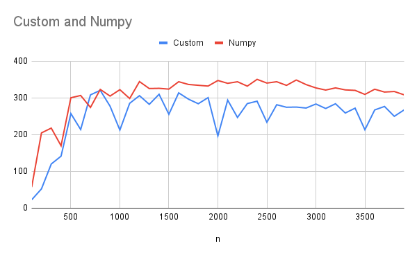

# Tiled Matmul

This project started as a very basic implementation of tiled/blocked matrix multiplication with padin, but kind of escalated into heavy optimization of a custom general matrix multiplication (GEMM) kernel.

I created many different versions along the way. Some of the more notable ones are in `decent-versions/`. The most performant one currently is `main.parallel6.c`, which averages at around `280 FP32 GFLOPS` with peaks up to `350 FP32 GFLOPS` (measured on square matrices up to `4000 x 4000` on an Inteil core i7-1250u). For comparison, Numpy with OpenBLAS does around `340 FP32 GFLOPS` avg.

It uses all tricks I know:
- Nested tiling and blockign accross m, n and k dimensions for cache reuse
- FMA
- SIMD
- Multithreading
- Proper memory alignment
- Loop unrolling
- Aggressive compiler optimization

I also added a bunch of little scripts for compiling, validating, benchmarking, comparing and analyzing different implementations.

### GFLOPS Comparison Custom Kernel vs Numpy

